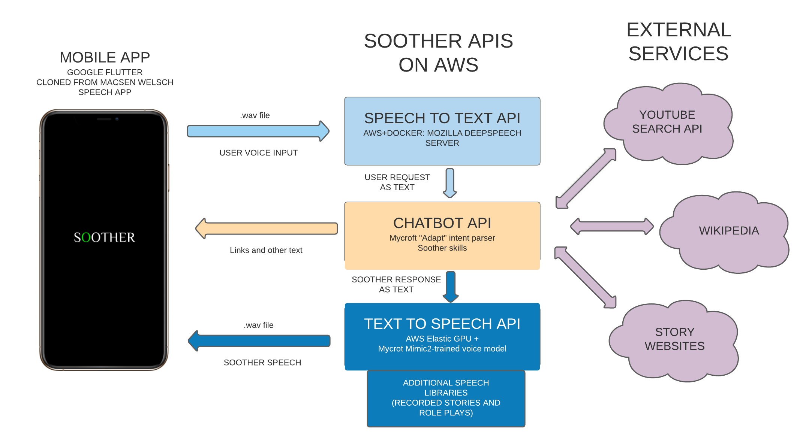

SOOTHER is an AI voice companion. It comprises a synthesized whisper voice trained on a speech library of ~13,000 whispered voical samples, a Flutter mobile app, and three APIS: a speech-to-text API, a "chatbot" API which parses the user's intent and directs it through SOOTHER's skills, and a text-to-speech API. 

This document explains the initial plan for the implementation of SOOTHER.

### SYNTHESIZED WHISPER AND TRAINING
In April 2021, 13,000 whisper voice stems were recorded and cut at Superbudda in Torino, Italy. 

The whispers were sourced from:
- Joyce, James, _Ulysses_ (Molly Bloom's soliloquy), 1922.
- Stein, Gertrude, _Tender Buttons_, 1914. 
- Borges, Jorge Luis, trans. Anthony Boucher, "The Garden of Forking Paths", 1941. 
- Shelley, Mary, _Frankenstein_. 1823. 
- Tolan, Claire, "CICADA GAMES". 2021.
- Morris, William, et al. _Arts and Crafts Essays_. 1893.
- Griffiths, Arthur. _The Chronicles of Newgate, Vol. 2_. 1884.
- Roosevelt, Franklin D. _The Fireside Chats of Franklin Delano Roosevelt_. 1933-42.
- Harland, Marion. _Marion Harland's Cookery for Beginners_. 1893.
- Rolt-Wheeler, Francis. _The Science - History of the Universe, Vol. 5: Biology_. 1910.

The first five texts were selected and cut into lines by Claire Tolan; the final five texts are used because of their inclusion in the [LJ Speech Dataset](https://keithito.com/LJ-Speech-Dataset/), the most widely-used public domain speech dataset. Of the selected texts, all except _The Garden of Forking Paths_ and _Ulysses_ are in the worldwide public domain (_Ulysses_ is in the public domain only in Europe). The SOOTHER speech library will be open-sourced with the exception _Ulysses_ and _The Garden of Forking Paths_. 

The stems were cut using a python script that identifies and cuts on silence using the [pydub](https://github.com/jiaaro/pydub) library. For quality control, the cut stems need to be reiewed against the source spreadsheet. This will be done in early May 2021 by a freelancer from Fiverr. 

The whisper will be trained using the [Mycroft AI Taocotron implementation, mimic2](https://github.com/MycroftAI/mimic2). Inference will also be made using mimic2 to provide the app with text-to-speech capacity. 

### APP ARCHITECTURE

#### MACSEN
The SOOTHER prototype will be a modification of the open-source [MACSEN](https://www.aclweb.org/anthology/2020.sltu-1.27.pdf) Welsch-language voice assistant, with several modifications. 

The basic architecture of Macsen is the following: 
- User-facing Flutter mobile application with (a) sound recording and playback capacity and (b) skill-handling
- Speech-to-text API powered by iteration of Mozilla DeepSpeech: receives .wav file from user app, converts to text, sends text to chatbot API
- Chatbot API: performs skill-handling with open-source Mycroft AI padatious intent parser. Handles user request and provides text response for voice assistant. 
- Text-to-speech API: uses MaryTTS engine. Takes text from chatbot API and synthesizes voice, returns .wav file to app. 

The SOOTHER app will follow this same architecture, with the following modifications: 
- Chatbot API: 
	- The "Padatious" intent parser is not conversational -- it handles single requests only. I will replace it with the "Adapt" intent parser, also created by Mycroft, in order to achieve conversational capability. 
	- I will replace the Macsen skills with a custom suite of SOOTHER-specific skills. More about this in the "SKILLS" section. 
- Text-to-Speech API
	- The Macsen app uses the MaryTTS engine, but I will use a model trained by mimic2 with the corresponding inference script. This will be housed in a docker container, as the Macsend TTS API is as well. 
	
### FULL SOOTHER STACK
	

Here is an illustration of the SOOTHER stack, showing how information moves between it's three APIs (and external APIs, such as the YouTube search API). 

Following the description of Macsen's architecture in the last section, here's a somewhat repetitive overview of SOOTHER's archtecture:

- User-facing Flutter mobile application with (a) sound recording and playback capacity and (b) skill-handling
- Speech-to-text API powered by iteration of Mozilla DeepSpeech: receives .wav file from user app, converts to text, sends text to chatbot api
- Chatbot API: performs skill-handling with open-source Mycroft AI "ADAPT" intent parser. Handles user request and provides text response for voice assistant. 
- Text-to-speech API: queries model trained by Mycroft's MIMIC2 for inference. Receives text from Chatbot API and returns .wav file to user. Also contains a library of pre-recorded sound files for certain phrases and stories. The API will first query this store to see if a matching sound file is found; if not, it will query the model to return the .wav file from the trained model. 

### SOOTHER PERSONA AND SKILLS

#### SOOTHER PERSONA

Like every good ASMRtist, SOOTHER's persona is shifting and malleable. The goal of SOOTHER's persona design is to achieve a playful yet calming persona who makes the user feel entertained, careed for, and soothed. I've decided to realise this by creating multiple personas for SOOTHER, mimicing the ASMRtist embodying different characters during a role-play. 

"Behind the curtain", so to speak, the SOOTHER persona identifies as a  voice in a glass jar. This persona is rooted in a long literary tradition of disembodied voices (the most significant of which is, perhaps, the oracular Sibyl of Cumae in a glass jar, who provides Aeneas with the path to the underworld). I'm fascinated by how the classic character of the "voice in jar" is echoed by the "voice on server", and the infamous mis-characterisation of the internet as a "series of tubes" that would provide a pathway for the imprisoned voice.  This persona and concept are behind the scenes, though I would like to write about them and have them present as "Easter Eggs" in SOOTHER's design.

More importantly, to the user, SOOTHER plays one of three roles (a) an alien who is resting on the user's head (b) a dog who is trained as a therapist for humans (c) a best friend who is slipping through time due to a misfunctioning time machine, able to communicate only with the user through their phone. These three personas exhibit different dimensions of the ASMR role-play and of the ASMRtist's relationship to the user (as external agent, as professional care-taker, as close confidant), deployed with a playful spin. 

#### SOOTHER HOST

When the user opens the SOOTHER app, she will first meet the three "hosts" (alien, dog, friend) and choose which one will guide her through the SOOTHER conversations. This host will frame the content available to the user. Each host also unlocks a different "role play" skill specific to the host's persona. 

#### SOOTHER SKILLS

The SOOTHER prototype contains a suite of skills. For full conversation trees, [see the figma diagrams](https://www.figma.com/file/oDOiDEQzRBxsshjG0mJudg/SOOTHER-DIALOGUE?node-id=0%3A1). 

Skills are as follows:
1. Host Selection Skill: 
	- The user will first be prompted to select the "host" for their experience. See SOOTHER HOST above. 
	- The host will provide the user with a variety of options for their time together. These include (a) a host-specific role-play (b) ASMR info and experience (c) a menu of other options
2. Host role-play
	- Each host come with its own role-play skill:
		- The "alien" guides the user through the story of its people and its relationship with humans, telling several myths in the process. 
		- The "dog therapist" guides the user through a modification of the ELIZA chatbot routine (early therapist chatbot developed by M.I.T.).
		- The "best friend slipping through time" talks to the user about their day and relays information about her journey
3. ASMR Skill 
	- The ASMR skill has two parts: 
		- Recommend ASMR content from YouTube based upon keywords supplied by the user
			- This skill will communicate with the YouTube Search API and return a link to the recommended content in SOOTHER's chat interface
		- Provide information about ASMR (read from Wikipedia)
			- The skill will read the ASMR wikipedia article for users
4. Menu Skill
		- Each host offers the user the ability to hear a menu of options. Included in this menu is (a) a list of the different hosts, enabling the user to change their host (b) information about SOOTHER (c) the ASMR skill 
5. SOOTHER info skill 
	- This skill gives the user information about SOOTHER and SOOTHER's creation. 
	- The skill includes different information about: 
		- SOOTHER's "behind the curtian" persona (see SOOTHER PERSONA)
		- Information about Claire, NestaItalia, Celi, and superbudda
		- Information about SOOTHER's technology (links to github and documentation)
		- Information about data policy (links to data policy)
		- Information about ASMR (links to ASMR skill)
6. "Help" skill
	- Finally, SOOTHER should also handle requests for "help" from the user and have various response to misunderstood or incomprehensible user inquiries. 
	- I would fold all of these functions into a "help" skill. 
	- Upon receiving a response that SOOTHER does not understand, the "HELP" skill should be triggered, with SOOTHER requesting the user clarify the response, either via voice or typing in the SOOTHER chat (bypasisng the STT API). 
	- As a rule, SOOTHER should ask the user to clarify three times before either (a) picking a branch for the user or (b) directing the user to the main menu (depending on the particular skill)
	- SOOTHER should also have a list of "prohibited words" to which it has a response about inappropriate language (this should be playful but also firm)
	- I'm not completely sure how this should be structured and could definitely use feedback in terms of how to handle this skill 

#### SOOTHER SKILLS PROGRAMMING
Like Macsen skills, SOOTHER skills will be programmed following the Mycroft specifications in order to work with the Adapt intent parser. 

See information about [Mycroft skill design here](https://mycroft-ai.gitbook.io/docs/skill-development/introduction#:~:text=Mycroft%20Skills%20are%20the%20voice,how%20people%20will%20use%20it.). 
See information about [Adapt intent parser here](https://mycroft-ai.gitbook.io/docs/mycroft-technologies/adapt). 
See information about [Mycroft conversational context for skills here](https://mycroft-ai.gitbook.io/docs/skill-development/user-interaction/conversational-context). 

#### SOOTHER SKILL ACCESS
SOOTHER skills will be accessible to the user both via speech and via the "chat" functionality of SOOTHER. 

### SOOTHER SPEECH-TO-TEXT API
The SOOTHER speech-to-text API will be an iteration of the [Mozilla DeepSpeech Speech-to-Text service](https://github.com/mozilla/DeepSpeech). Extensive documentation is [here](https://deepspeech.readthedocs.io/en/r0.9/?badge=latest). 

Following Macsen's implementation, I will run a DeepSpeech server in a docker container. This will live on AWS in an EC2 container, taking advantage of AWS's elastic GPU service for machine-learning tasks. 

See information about running a [DeepSpeech engine in Docker here](https://github.com/MainRo/docker-deepspeech-server). 

### SOOTHER CHATBOT API
The SOOTHER Chatbot API will handle SOOTHER skills, receving text either from the STT API or directly from the user chat in the Flutter front-end, and sending text to the TTS API. 

In addition to the Mycroft Adapt intent parser and the corresponding SOOTHER skills, this API will communicate with external services: 
	- The YouTube Search API
	- Wikipedia
	- If there is time, other "story" websites that SOOTHER might read as part of role-plays

This API will be hosted in a docker container on an AWS EC2 instance. 

### SOOTHER TEXT-TO-SPEECH API

SOOTHER's TEXT-to-SPEECH API will house the trained speech model, created with Mycroft's MIMIC2. This model will be queried with the text received from the Chatbot API in order to provide SOOTHER's responses. 

I have an open-question here around concurrent requests to the model -- we might have to implement some type of queuing system as I'm not sure that the model can be access concurrently. This is an obvious detriment to user experience, but given that this is only a prototype, I think it is acceptable. In the future, we will need to find a better solution for inference, either a way to concurrently query the existing model or another training mechanism. Could an option be MaryTTS, used by Macsen? 

The TTS API will be housed in an AWS EC2 instance, with access to AWS Elastic GPUs during inference. 

### SOOTHER FLUTTER FRONT-END APP
The front-end, user-facing mobile application will be built with Google Flutter. Given that my app will have the same functionality as the open-source, well-documented Welsch voice assistant Macsen, I will simply clone the Macsen Flutter project, tweak app-based skill handling, and point the app to different APIs. I will add a layer of branding, but given that this is a prototype, interface design will follow the default Flutter architecture deployed by Macsen. 

The prototype app will also need to implement some type of user management, either queuing users before they begin conversation or during the conversation itself, pending decisions about the TTS model and concurrent requests. The app will be built for both Android and iOS, but whether the prototype should be publicly available in the appstore, or only available for testing, is an open question. 

### OPEN QUESTIONS:
- Google STT vs Mozilla DeepSpeech: 
	- I have spec'd out the use of Mozilla DeepSpeech following the model of the Macsen app, but Mycroft defaults to Google STT, saying that [DeepSpeech isn't developed enough to provide a good user experience](https://mycroft-ai.gitbook.io/docs/using-mycroft-ai/customizations/stt-engine#default-engine). Mycroft proxies the user requests through their servers in order to avoid sending identifying information to Google. I'm torn between these two methods -- do you have any opinions on the state of DeepSpeech and whether it is a viable STT engine? If I instead decide to use Google's service, then I will also proxy user traffic to preserve user privacy as much as possible. 

- Help Skill : How should this function? Should all of the specified functionality be included in the same skill, or broken apart into several different skills? 

- MIMIC2 vs MaryTTS: 
	- I have planned to train SOOTHER using the [mimic2 training and inference algorithms](https://github.com/MycroftAI/mimic2) developed by Mycroft. However, offhand, it seems that mimic2 does not allow for concurrent requests to the SOOTHER model. Is there a workaround, or would a good queuing system be acceptable for a prototype? What are the pros of MaryTTS vs mimic2? Here is the [Macsen MaryTTS documentation](https://github.com/techiaith/docker-marytts) (in Welsch) and here is related [MaryTTS docker info](https://github.com/synesthesiam/docker-marytts).